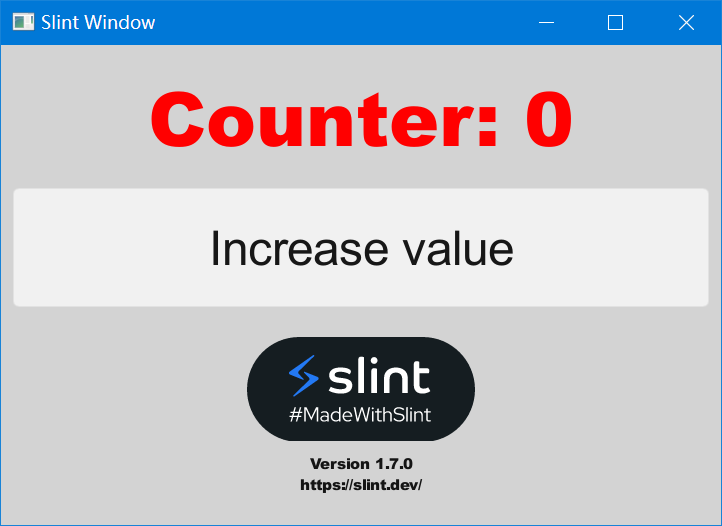

# Slint-Cpp HelloWorld

## 代码

* [Slint Getting Started Tutorial](https://slint.dev/releases/1.5.1/docs/tutorial/cpp/)
* [GitHub - slint-ui/slint-cpp-template](https://github.com/slint-ui/slint-cpp-template#slint-c-template)

### main.cpp
```cpp
#include "appwindow.h"
#include <stdlib.h>
#include <stdio.h>
#include <windows.h>
#include <windef.h>
#include <roapi.h>

HRESULT RoGetActivationFactory(
    HSTRING activatableClassId,
    REFIID  iid,
    void    **factory)
{
    return S_OK;
}

int main(int argc, char **argv)
{
    auto ui = AppWindow::create();

    ui->on_request_increase_value([&]{
        ui->set_counter(ui->get_counter() + 1);
    });

    ui->run();
    return 0;
}

```
#### 注意
* 编译过程中会出现链接libslint_cpp.a时找不到 **RoGetActivationFactory** 函数的问题，经过搜索这个函数是winrt(arm)平台的一个函数, 在rust的 **windows-core** 模块中调用, 由LLVM-MinGW工具链的 **libcombase.a** 库提供, 但是windows x64平台下的LLVM-MinGW工具链中没有这个库, 所以暂时通过重写 **RoGetActivationFactory** 函数的方式规避该问题, 经过测试暂时没发现问题, 代码如下:

```cpp
#include <windows.h>
#include <windef.h>
#include <roapi.h>

HRESULT RoGetActivationFactory(
    HSTRING activatableClassId,
    REFIID  iid,
    void    **factory)
{
    return S_OK;
}
```

* [RoGetActivationFactory function (roapi.h) - Win32 apps](https://learn.microsoft.com/en-us/windows/win32/api/roapi/nf-roapi-rogetactivationfactory)

### appwindow.slint

* [SlintPad： Web based slint editor](https://slintpad.com/)

```cpp
import { Button, VerticalBox } from "std-widgets.slint";

export component AppWindow inherits Window {
    in-out property<int> counter: 0;
    callback request-increase-value();
    max-width: 480px;
    max-height: 320px;
    min-width: 480px;
    min-height: 320px;
    vertical-stretch: 0;
    horizontal-stretch: 0;
    background: lightgray;
    // no-frame: true;
    default-font-size: 30px;
    default-font-weight: 900;
    VerticalBox {
        alignment: center;
        Text {
            text: "Counter: \{root.counter}";
            font-size: 50px;
            horizontal-alignment: center;
            vertical-alignment: center;
            preferred-height: 100px;
            preferred-width: 200px;
            color: red;
        }
        Button {
            text: "Increase value";
            preferred-height: 100px;
            preferred-width: 200px;
            clicked => {
                root.request-increase-value();
            }
        }
     }
}

```

### CMakeLists.txt
```cmake
cmake_minimum_required(VERSION 3.21)
project(slint_hello LANGUAGES CXX)

find_package(Slint QUIET)
if (NOT Slint_FOUND)
  message("Slint could not be located in the CMake module search path. Downloading it from Git and building it locally")
  include(FetchContent)
  FetchContent_Declare(
    Slint
    GIT_REPOSITORY https://github.com/slint-ui/slint.git
    # `release/1` will auto-upgrade to the latest Slint >= 1.0.0 and < 2.0.0
    # `release/1.0` will auto-upgrade to the latest Slint >= 1.0.0 and < 1.1.0
    GIT_TAG release/1
    SOURCE_SUBDIR api/cpp
  )
  FetchContent_MakeAvailable(Slint)
endif (NOT Slint_FOUND)

add_executable(slint_hello src/main.cpp)
target_link_libraries(slint_hello PRIVATE Slint::Slint)
slint_target_sources(slint_hello ui/appwindow.slint)
# On Windows, copy the Slint DLL next to the application binary so that it's found.
# if (WIN32)
#     add_custom_command(TARGET slint_hello POST_BUILD COMMAND ${CMAKE_COMMAND} -E copy $<TARGET_RUNTIME_DLLS:slint_hello> $<TARGET_FILE_DIR:slint_hello> COMMAND_EXPAND_LISTS)
# endif()

```

## 编译参数
```bash
cmake -G "MinGW Makefiles" -B my_build \
	-DCMAKE_BUILD_TYPE:STRING=MinSizeRel \
	-DCMAKE_CXX_COMPILER:STRING="C:/LLVM-MinGW/ucrt/bin/clang++.exe" \
	-DCMAKE_MAKE_PROGRAM:FILEPATH="C:/LLVM-MinGW/ucrt/bin/make.exe" \
	-DCMAKE_C_COMPILER:STRING="C:/LLVM-MinGW/ucrt/bin/clang.exe" \
	-DCMAKE_CXX_FLAGS:STRING="-Os -flto -DNDEBUG -ffunction-sections -fdata-sections" \
	-DCMAKE_C_FLAGS:STRING="-Os -flto -DNDEBUG -ffunction-sections -fdata-sections" \
	-DCMAKE_CXX_STANDARD_LIBRARIES:STRING="-lkernel32 -luser32 -lgdi32 -lwinspool -lshell32 -lole32 -loleaut32 -luuid -lcomdlg32 -ladvapi32 -lcomctl32 -liphlpapi -lws2_32 -lntoskrnl -lbcrypt -lopengl32 -luiautomationcore -lpropsys -ldwmapi -limm32 -luxtheme -luserenv  -static" \
	-DCMAKE_CXX_STANDARD_LIBRARIES:STRING="-lkernel32 -luser32 -lgdi32 -lwinspool -lshell32 -lole32 -loleaut32 -luuid -lcomdlg32 -ladvapi32 -lcomctl32 -liphlpapi -lws2_32 -lntoskrnl -lbcrypt -lopengl32 -luiautomationcore -lpropsys -ldwmapi -limm32 -luxtheme -luserenv  -static" \
	-DCMAKE_STATIC_LINKER_FLAGS:STRING="-Os -DNDEBUG -Wl,-subsystem,windows -Wl,--gc-sections  -static" \
	-DCMAKE_EXE_LINKER_FLAGS:STRING="-Os -DNDEBUG -Wl,-subsystem,windows -Wl,--gc-sections  -static" \
	-DSLINT_COMPILER:FILEPATH="D:/Work/work_code/GUI/Slint-cpp/slint-cpp-release/bin/slint-compiler.exe" \
	-DSlint_DIR:PATH="D:/Work/work_code/GUI/Slint-cpp/slint-cpp-release/lib/cmake/Slint" \
	-DCMAKE_INSTALL_PREFIX:PATH=my_install
```
### 注意
* **Slint_DIR** :  知道Slint-Cpp静态库路径, (包含Cmake文件的路径)
* **SLINT_COMPILER** : Slint文件编译器路径, 包含在Slint-Cpp静态库中
* **LDFLAGS+= -Wl,-subsystem,windows** : 链接参数中需要增加 **-Wl,-subsystem,windows** , 不然编译出来的程序运行时会带命令行窗口

### 编译脚本
```bat
@echo off

set target=slint_hello

set cur_path=%cd%
set cmake_exe=cmake.exe
set upx_exe="D:\Program Files\upx\upx.exe"

set llvm_dir=C:/LLVM-MinGW/ucrt
set strip_exe=%llvm_dir%/bin/llvm-strip.exe
set slint_dir=D:/Work/work_code/GUI/Slint-cpp/slint-cpp-release

set build_dir=build
set install_dir=install

set cflags=-Os -flto -DNDEBUG -ffunction-sections -fdata-sections -static
set ldlibrary=-lkernel32 -luser32 -lgdi32 -lwinspool -lshell32 -lole32 -loleaut32 -luuid -lcomdlg32 -ladvapi32 -lcomctl32 -liphlpapi -lws2_32 -lntoskrnl -lbcrypt -lopengl32 -luiautomationcore -lpropsys -ldwmapi -limm32 -luxtheme -luserenv -static
set ldflags=-Os -DNDEBUG -Wl,-subsystem,windows -Wl,--gc-sections -static

echo "Del build cache"
rmdir /s /q %build_dir%
mkdir %build_dir%
call :my_sleep

echo "Run cmake generator"
%cmake_exe% -G "MinGW Makefiles" -B "%build_dir%" ^
    -DCMAKE_VERBOSE_MAKEFILE:BOOL=ON ^
    -DCMAKE_BUILD_TYPE:STRING=MinSizeRel ^
    -DCMAKE_CXX_COMPILER:STRING="%llvm_dir%/bin/clang++.exe" ^
    -DCMAKE_MAKE_PROGRAM:FILEPATH="%llvm_dir%/bin/mingw32-make.exe" ^
    -DCMAKE_C_COMPILER:STRING="%llvm_dir%/bin/clang.exe" ^
    -DCMAKE_CXX_FLAGS:STRING="%cflags%" ^
    -DCMAKE_C_FLAGS:STRING="%cflags%" ^
    -DCMAKE_CXX_STANDARD_LIBRARIES:STRING="%ldlibrary%" ^
    -DCMAKE_CXX_STANDARD_LIBRARIES:STRING="%ldlibrary%" ^
    -DCMAKE_STATIC_LINKER_FLAGS:STRING="%ldflags%" ^
    -DCMAKE_EXE_LINKER_FLAGS:STRING="%ldflags%" ^
    -DSLINT_COMPILER:FILEPATH="%slint_dir%/bin/slint-compiler.exe" ^
    -DSlint_DIR:PATH="%slint_dir%/lib/cmake/Slint" ^
    -DCMAKE_INSTALL_PREFIX:PATH="%install_dir%"
if %errorlevel% neq 0 goto my_error
call :my_sleep

echo "Run cmake build [%cmake_exe% --build %build_dir%]"
%cmake_exe% --build %build_dir%
if %errorlevel% neq 0 goto my_error
call :my_sleep

if exist %strip_exe% (
    echo "Run strip [%strip_exe% --strip-all %build_dir%/%target%.exe]"
    %strip_exe% --strip-all %build_dir%/%target%.exe
    if %errorlevel% neq 0 goto my_error
    call :my_sleep
) else (
    echo "Skip strip"
)

if exist %upx_exe% (
    echo "Run upx [%upx_exe% %build_dir%/%target%.exe]"
    rem %upx_exe% -9 --ultra-brute %build_dir%/%target%.exe
    %upx_exe% %build_dir%/%target%.exe
    if %errorlevel% neq 0 goto my_error
    call :my_sleep
) else (
    echo "Skip upx"
)

echo "Run [%build_dir%/%target%.exe]"
%build_dir%\%target%.exe
if %errorlevel% neq 0 goto my_error
goto my_success

:my_sleep
rem echo "wait 1s ..."
ping 127.0.0.1 -n 2 > nul
goto :eof

:my_success
echo "Build success!"
goto :eof

:my_error
echo "Build failed!"
goto :eof
```

### 运行


